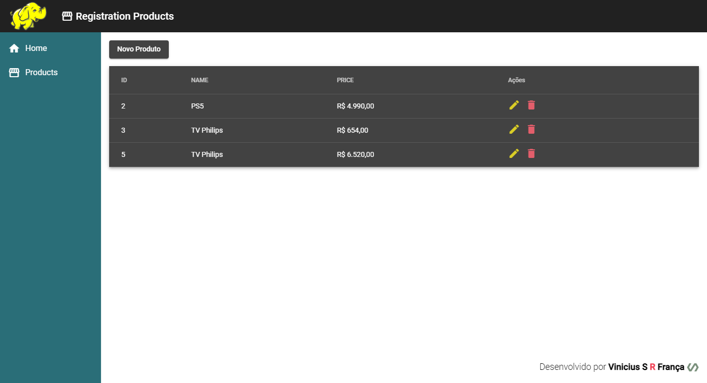
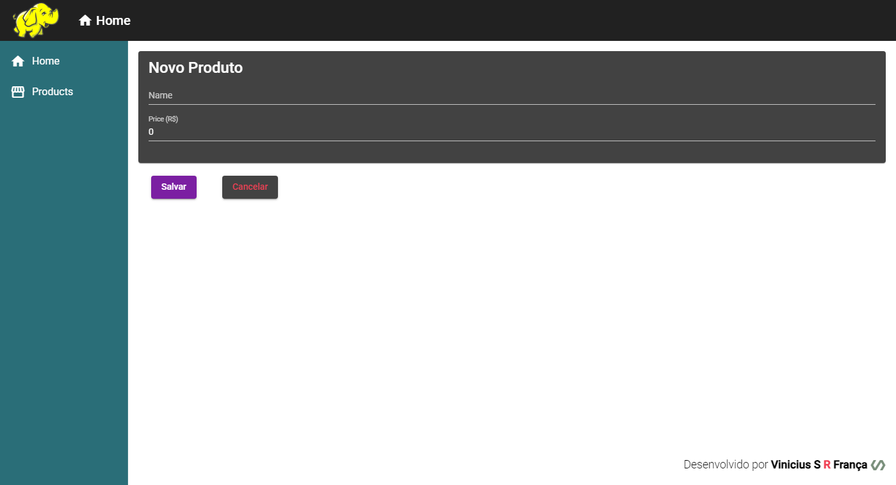
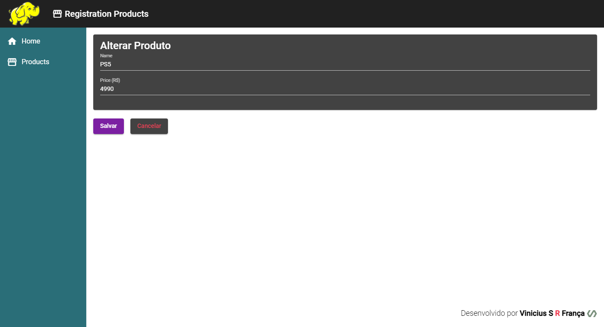
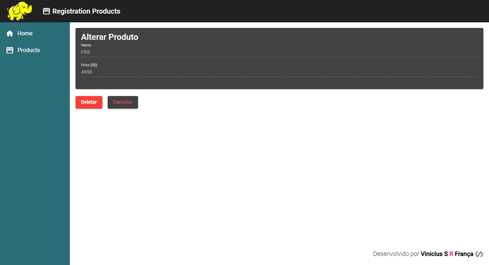

# Registration-System-Angular

This project was generated with [Angular CLI](https://github.com/angular/angular-cli) version 13.3.0.

## Development server

Run `ng serve` for a dev server. Navigate to `http://localhost:4200/`. The application will automatically reload if you change any of the source files.

<h1>Projeto Básico de Cadastro de Produtos</h1>
<h2>Funcionalidades</h2>
<ul>
  <li>Criação</li>
  <li>Exibição</li>
  <li>Edição</li>
  <li>Exclusão</li>
</ul>

